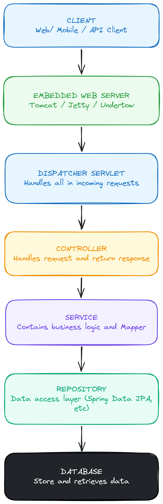

# Spring Boot Architecture Explained: A Complete Guide for Backend Developers

Anyone who has spun up a REST API with Spring Boot for the first time knows the feeling: you add one annotation, write a
controller, hit run, and the application is suddenly alive and answering HTTP requests. It can feel like magic.

It isn't. Every "automatic" behavior in Spring Boot is the result of a deliberate, well-engineered process running
behind the scenes. Understanding that process pays off well beyond interviews — it's what lets you debug production
issues, tune startup time, and design applications that scale cleanly.

This guide walks through that process layer by layer.

---

## The High-Level Picture

***

At the highest level, nearly every Spring Boot request follows the same path:



Each box has exactly one job. Let's go through them in order — starting with what happens *before* any request ever
arrives.

---

## 1. Application Startup

***

Every Spring Boot app starts from a class like this:

```java

@SpringBootApplication
public class Application {
    public static void main(String[] args) {
        SpringApplication.run(Application.class, args);
    }
}
```

It's easy to copy this boilerplate without thinking about it, but `SpringApplication.run()` is doing a lot of work in
that split second:

- Builds the application context
- Scans the project for components
- Initializes and wires up beans
- Applies auto-configuration based on what's on the classpath
- Boots the embedded web server
- Signals that the app is ready to accept traffic

A useful mental model: this is like powering on an entire factory floor before the first customer order comes in.

---

## 2. Component Scanning & Dependency Injection

***

One of Spring's core strengths is that it finds and manages your objects for you. During startup it scans your packages
for annotations like `@Component`, `@Service`, `@Repository`, `@Controller`, and `@RestController`. Any class carrying
one of these gets instantiated and managed automatically — you never call `new UserService()` yourself.

This automatic wiring is called **Dependency Injection (DI)**: instead of a class constructing the objects it depends
on, Spring hands those objects to it.

```java

@RestController
public class UserController {

    private final UserService userService;

    public UserController(UserService userService) {
        this.userService = userService; // supplied by Spring, not "new"
    }
}
```

Why bother? A few concrete benefits:

- Less boilerplate wiring code
- Classes are easier to unit test (swap in mocks)
- Lower coupling between classes
- Centralized, consistent object lifecycle management

Think of it like starting a new job where your laptop is already set up on your desk, rather than you having to assemble
it yourself.

---

## 3. Auto-Configuration

***

This is arguably Spring Boot's signature feature. Add a dependency like `spring-boot-starter-data-jpa`, and Spring Boot
infers that you'll probably need a `DataSource`, an `EntityManager`, a transaction manager, and Hibernate
configuration — and it wires up sensible defaults for all of them without you writing a line of config.

The guiding philosophy is simple:

> *If the developer hasn't explicitly configured something, provide a sensible default.*

That's what turns a multi-file XML setup process into "add a dependency, and it just works."

---

## 4. Embedded Web Server

***

Before Spring Boot, deploying a Java web app meant installing and configuring a server separately — Tomcat, Jetty, or
something heavier like WebSphere — and then dropping your WAR file into it.

Spring Boot flips this: the server ships *inside* your application jar. Running:

```bash
java -jar application.jar
```

starts the embedded server automatically, with nothing to install on the host. This is a big part of why Spring Boot
fits so naturally into containerized and cloud-native deployments.

---

## 5. DispatcherServlet — The Traffic Controller

***

Every HTTP request entering a Spring Boot app passes through a single front door: the `DispatcherServlet`. It doesn't do
any business work itself — it reads the request, checks your URL mappings, and routes the request to the right handler.

A good analogy: DispatcherServlet is the receptionist at the front desk. It doesn't solve your problem, but it knows
exactly who should.

```
GET /users/10  →  DispatcherServlet  →  matches @GetMapping("/users/{id}")
```

---

## 6. Controller Layer

***

Controllers are the entry point for handling a specific request. They should stay thin:

```java

@RestController
public class UserController {

    private final UserService userService;

    public UserController(UserService userService) {
        this.userService = userService;
    }

    @GetMapping("/users")
    public List<User> getUsers() {
        return userService.getUsers();
    }
}
```

A controller's job is narrow and specific:

- Accept the incoming request
- Validate input
- Delegate to the service layer
- Shape and return the response

Business logic doesn't belong here — that's the next layer's job.

---

## 7. Service Layer

***

The service layer is where actual business rules live. Picture an e-commerce checkout: the controller receives the
order, but it's the service that decides whether stock is available, whether payment should be processed, and whether a
discount applies.

```java

@Service
public class UserService {

    private final UserRepository userRepository;

    public UserService(UserRepository userRepository) {
        this.userRepository = userRepository;
    }

    public List<User> getUsers() {
        return userRepository.findAll();
    }
}
```

Services coordinate the actual behavior of the application — they're the layer that "knows what the business wants to
happen."

---

## 8. Repository Layer

***

Repositories talk to the database and nothing else:

```java

@Repository
public interface UserRepository extends JpaRepository<User, Long> {
}
```

Notice there's no SQL here — Spring Data JPA generates the implementation for you at runtime. The repository's job is
intentionally narrow: **store data, retrieve data.** It shouldn't contain decision-making logic; that belongs in the
service layer above it.

---

## 9. The Database

***

At the bottom of the stack sits the database itself — MySQL, PostgreSQL, Oracle, SQL Server, or similar. Spring Boot
talks to it through JPA or JDBC, abstracting away most of the low-level plumbing. Keeping data access isolated behind
the repository layer is what makes it possible to change databases, add caching, or optimize queries without touching
business logic.

---

## Tracing a Real Request

***

Here's the full round trip for `GET /users/5`:

```
Browser
  │
  ▼
Embedded Tomcat
  │
  ▼
DispatcherServlet
  │
  ▼
UserController
  │
  ▼
UserService
  │
  ▼
UserRepository
  │
  ▼
Database
  │
  ▼  (response flows back up the same layers, in reverse)
UserRepository → UserService → UserController → JSON Response
```

Every layer does exactly one job and hands off to the next — that discipline is what keeps a growing codebase
maintainable.

---

## The Spring IoC Container

***

Underpinning all of this is the **IoC (Inversion of Control) Container** — the part of Spring responsible for:

- Creating objects
- Managing their lifecycle
- Injecting their dependencies
- Cleaning them up on shutdown

Normally, your code controls when objects get created. Spring flips that responsibility onto the framework itself —
hence "Inversion of Control." You can think of the IoC container as the application's manager, deciding when things are
born and when they're retired.

### Bean Lifecycle

***

Every object the container manages is called a **bean**, and each one moves through the same lifecycle:

1. Spring scans the class and finds it
2. The bean is instantiated
3. Its dependencies are injected
4. Initialization callbacks run
5. The bean becomes available for use
6. The application uses it
7. The bean is destroyed on shutdown

Knowing this sequence explains a lot of otherwise-mysterious startup and shutdown behavior.

---

## Why Bother With Layers at All?

***

A fair question from anyone new to the framework: *why can't I just query the database straight from the controller?*
Technically, you can — but separating concerns into layers buys you:

- Easier unit testing (mock one layer, test another in isolation)
- Cleaner, more readable code
- Better scalability as the app grows
- The ability for large teams to work on different layers independently

---

## Common Mistakes to Avoid

***

| Mistake                                                      | Why it hurts                                | Fix                                                         |
|--------------------------------------------------------------|---------------------------------------------|-------------------------------------------------------------|
| Business logic in controllers                                | Controllers become bloated and hard to test | Push logic down into services                               |
| Calling repositories from multiple places                    | Breaks consistency in how data is accessed  | Route all repository access through services                |
| Manually instantiating managed classes (`new UserService()`) | Bypasses Spring's lifecycle and DI benefits | Use constructor injection and let Spring manage it          |
| Ignoring what auto-configuration does                        | Makes debugging startup issues much harder  | Learn what's configured automatically for your dependencies |

---

## The Big Takeaway

***

Spring Boot's real value isn't that it hides complexity — it's that it *organizes* it. The framework doesn't eliminate
the need for good architecture; it gives you sensible, battle-tested patterns so teams don't have to reinvent the
foundation on every new project.

The next time `SpringApplication.run()` finishes in a couple of seconds and your app is live, remember: underneath that
single line is an entire ecosystem — component scanning, dependency injection, auto-configuration, an embedded server,
and a layered request pipeline — all cooperating to hand you a production-ready application.

---

*Adapted and reorganized from "Spring Boot Architecture Explained: A Complete Guide for Backend Developers" by Ram (
Medium, Jun 2026).*
